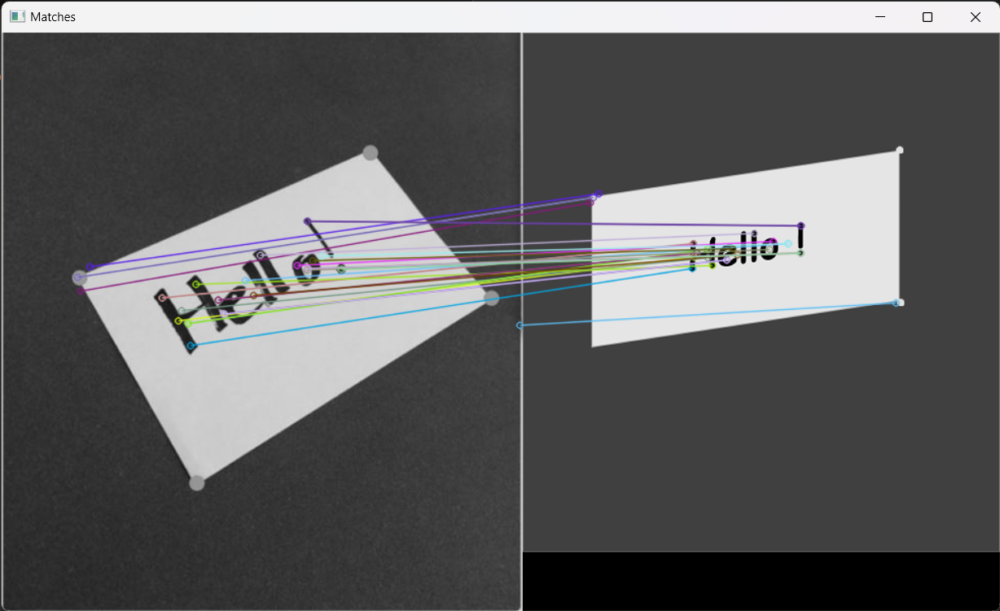

# Feature detection and matching


## Table of Contents
- [Explanation](#explanation)
- [Usage](#usage)
- [Code Example](#code-example)
- [API Documentation](#api-documentation)

---
## Explanation

This project is a Python implementation of the SIFT and ORB feature detection algorithms, along with their matching algorithms, such as BFMatcher and FLANN. The project demonstrates how to use these algorithms to find matches between two images.
---
## Usage

To use this project, you will need to have Python and the OpenCV library installed. Simply clone the repository and run the Python script(s) provided. The source code is organized into three main files:

 [`SIFT_FLANN`](.\SIFT_FeatureMatcher\SIFT_FLANN.py): Demonstrates the usage of the SIFT algorithm with the FLANN matching algorithm.

 [`ORB_BFM`](.\ORB_FeatureMatcher\ORB_BFM.py): Demonstrates the usage of the ORB algorithm with the BFMatching algorithm.

 [`SIFT_BFM.py`](.\SIFT_FeatureMatcher\SIFT_BFM.py): Demonstrates the usage of the SIFT algorithm with the BFMatching algorithm.
---
## Code Example

Here is an example of how to use the `ORB and BFM FeatureMatcher` script:

This script reads two images, 'hello.JPG' and 'hello.png', and performs ORB feature matching
using the `FeatureMatcher` class from the `ORB_FeatureMatcher` module. The matched features
are then displayed in a window.

Output:
    The matched features are displayed in a window.

```python
from FeatureMatcher.ORB_FeatureMatcher import ORBBFMMatcher
import cv2

# Read images
images = [cv2.imread('hello.JPG'), cv2.imread('hello.png')]

# Create a FeatureMatcher object
feature_matcher = ORB_FeatureMatcher(images)

# Perform feature matching
final_img = feature_matcher.feature_matching()

# Display the matches
cv2.imshow("Matches", final_img)
cv2.waitKey()
cv2.destroyAllWindows()

```
The other two methods have the same methodology you should only replace the class instace by another.

Here is an example of how to use the `SIFT+FLANN.py` script:
```python
from FeatureMatcher.SIFT_FeatureMatcher import SIFTFLANNMatcher, SIFTBFMMatcher

# Create a FeatureMatcher object
flann_feature_matcher = SIFTFLANNMatcher(images)

# Perform feature matching
flann_final_img = flann_feature_matcher.feature_matching()

# Create a FeatureMatcher object
bfm_feature_matcher = SIFTBFMMatcher(images)

# Perform feature matching
bfm_final_img = bfm_feature_matcher.feature_matching()
```
---
# API Documentation

## **ORBBFMMatcher**

    Class for performing feature matching using ORB and Brute-Force Matcher.

    Attributes:
        images (list): List of images to perform feature matching on.

    Methods:
        feature_matching()-> numpy.ndarray
            Performs feature matching using ORB and Brute-Force Matcher. 
## **SIFTFLANNMatcher**
    This class performs feature matching using SIFT and FLANN algorithms.

    Methods:

        feature_matching() -> numpy.ndarray
            Perform feature matching using SIFT and FLANN algorithms.
            Apply SIFT algorithm to extract key points and descriptors from the input images,
            and then uses FLANN algorithm to find matches between the descriptors.
            Finally, it draws the good matches on the images and returns the result.

## **SIFTFLANNMatcher**
    This class performs feature matching using SIFT and FLANN algorithms.

    Methods:

        feature_matching() -> numpy.ndarray
            Perform feature matching using SIFT and FLANN algorithms.
            Apply SIFT algorithm to extract key points and descriptors from the input images,
            and then uses FLANN algorithm to find matches between the descriptors.
            Finally, it draws the good matches on the images and returns the result.
## SIFTBFMMatcher:
    This class performs feature matching using SIFT and Brute-Force Matcher algorithms.

    Methods:

        feature_matching(self) -> numpy.ndarray
            Perform feature matching using SIFT and Brute-Force Matcher algorithms.
            Apply SIFT algorithm to extract key points and descriptors from the input images,
            and then uses Brute-Force Matcher algorithm to find matches between the descriptors.
            Finally, it draws the good matches on the images and returns the result.
